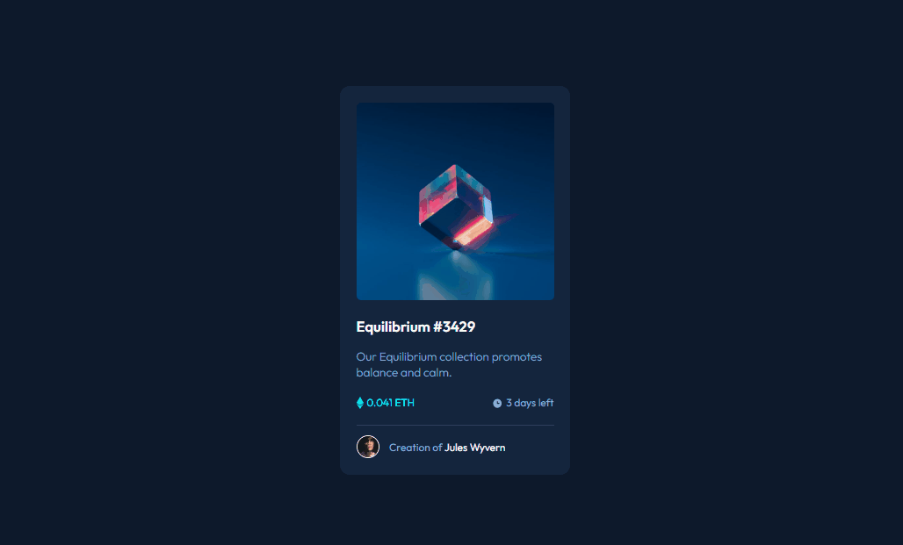

### Projeto Front-End Mentor

### Com Dev em Dobro

[]

# Frontend Mentor - NFT preview card component

## Welcome! 👋

**Para fazer esse desafio, você precisa ter um conhecimento básico de HTML e CSS.**

## Status ativo

[]

## O desafio

Seu desafio é construir este componente de cartão de visualização e fazê-lo parecer o mais próximo possível do design.

Você pode usar qualquer ferramenta que desejar para ajudá-lo a completar o desafio. Então, se você tem algo que gostaria de praticar, sinta-se à vontade para tentar.

Seus usuários devem ser capazes de:

- Visualize o layout ideal dependendo do tamanho da tela do dispositivo
- Veja os estados de foco para elementos interativos

**Have fun building!** 🚀

